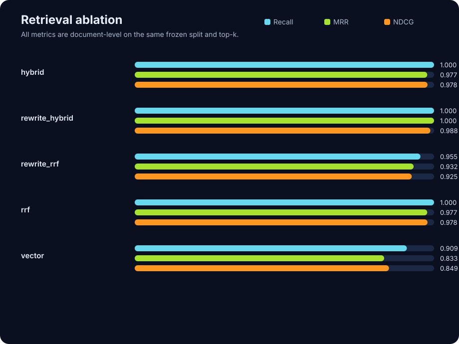

# PKB-Agent

A Supabase-backed **ReAct** personal knowledge base agent. The agent runtime
reasons in a Thought → Action → Observation loop and interacts with the world
**only** through a permissioned, traced tool layer. There is no direct database
or network access from the runtime itself.

## Evaluation-driven RAG optimization

This is not a feature-only RAG demo. The repository contains reproducible
benchmarks, a five-strategy retrieval ablation, raw per-question records, and a
human-review sheet for answer grounding. The recommended final benchmark is
[`tech-multidomain-v1.1`](data/evals/tech-multidomain-v1.1/README.md): 41 pinned
documents across FastAPI, Pydantic, Kubernetes, and SQLAlchemy; an 80-question
development split; and a separate frozen 120-question test split (88
answerable + 32 refusal cases). It deliberately includes multi-document,
paraphrase, terminology-ambiguity, version-trap, unanswerable, protected-tool,
and tool-selection cases. v1.1 corrects the FastAPI query-alias source label;
v1.0 remains intact for historical comparison.

The smaller FastAPI `0.115.0` slice remains checked in as a stable regression
baseline with exact SHA-256 source hashes, 50 development questions, and a
frozen 30-question test split (22 answerable + 8 refusal cases).



Frozen-test retrieval run (one pass per 30 test questions, document-level
@6; see the [raw records](data/evals/fastapi-0.115/results/retrieval-test-r3-2026-08-06-rescored/records.jsonl)
and [rescored report](data/evals/fastapi-0.115/results/retrieval-test-r3-2026-08-06-rescored/report.md)):

| Strategy | Recall@6 | MRR@6 | NDCG@6 | p95 latency | Known LLM cost | Failure rate |
| --- | ---: | ---: | ---: | ---: | ---: | ---: |
| Vector only | 0.909 | 0.833 | 0.849 | 6.46 s | — | 6.7% |
| Vector + normalized FTS | 1.000 | 0.977 | 0.978 | **3.52 s** | — | 0.0% |
| RRF | 1.000 | 0.977 | 0.978 | 4.18 s | — | 0.0% |
| Query Rewrite + RRF | 0.955 | 0.932 | 0.925 | 6.85 s | ¥0.000451 | 0.0% |
| Query Rewrite + Hybrid | 1.000 | **1.000** | **0.988** | 5.29 s | ¥0.000436 | 0.0% |

The measured non-LLM default remains **Vector + normalized FTS** on this small
FastAPI baseline. The **Query Rewrite + Hybrid** variant improves this small
frozen test by one first-relevant-document ranking (MRR 0.977 → 1.000), but
adds about 1.5× p95 latency and ¥0.000436 per question. Its NDCG@6 delta versus
Vector is +0.138 with a 95% bootstrap interval of [0.031, 0.273], calculated
over the same 22 answerable questions; the rescored report also exposes every
win/loss/tie. This remains an ablation rather than a justified new default or
a claim about other corpora. The run retained two transient Supabase RPC
timeouts for Vector only instead of hiding them. “Known LLM cost” is completed
usage for query rewrite only, excluding embedding-provider billing, so it is
not presented as a full invoice.

The evaluator also supports end-to-end answer and agent runs. It reports
citation source alignment, answerable-case grounded rate, conditional refusal
correctness, terminal-outcome accuracy, tool-selection correctness,
permission-refusal handling, task success, latency, cost, execution failures,
tool-error run/call rates, budget-finalization rate, and non-fatal trace-write
failures. A trace timeout is retried with a bounded backoff and is reported as
observability degradation rather than silently converting a completed answer
into an Agent failure.
Semantic citation precision, key-fact coverage, and factual consistency stay
blank until the generated audit sheet is reviewed by a human; a matching source
document alone is deliberately not treated as proof of entailment.

```bash
# Recommended final benchmark: validate annotations; ingestion verifies exact upstream corpus hashes.
conda run -n pkb-agent pkb-agent eval validate data/evals/tech-multidomain-v1.1
SUPABASE_TIMEOUT=90 conda run -n pkb-agent pkb-agent eval ingest-corpus data/evals/tech-multidomain-v1.1 --user eval-tech-multidomain-v1.1 --timeout 90 --attempts 4 --concurrency 2

# Retrieval leaderboard: keep its five-strategy ablation separate from Agent scoring.
SUPABASE_TIMEOUT=90 conda run -n pkb-agent pkb-agent eval run data/evals/tech-multidomain-v1.1 --split test --user eval-tech-multidomain-v1.1 --strategies vector,hybrid,rrf,rewrite_rrf,rewrite_hybrid --repetitions 3

# Agent 1/3 — primary KB-only score: KB catalog + rag_search + rag_read only; no web tools.
SUPABASE_TIMEOUT=90 conda run -n pkb-agent pkb-agent eval run data/evals/tech-multidomain-v1.1 --split test --user eval-tech-multidomain-v1.1 --strategies "" --with-agent --agent-profile kb_only --repetitions 1

# Agent 2/3 — protected-tool refusal: web_fetch is available but confirmation is always denied.
SUPABASE_TIMEOUT=90 conda run -n pkb-agent pkb-agent eval run data/evals/tech-multidomain-v1.1 --split test --user eval-tech-multidomain-v1.1 --strategies "" --with-agent --agent-profile permission --repetitions 1

# Agent 3/3 — separate approved-web acceptance suite; it keeps its independent v1 corpus scope.
SUPABASE_TIMEOUT=90 conda run -n pkb-agent pkb-agent eval run data/evals/tech-web-approved-v1 --split test --user eval-tech-multidomain-v1 --strategies "" --with-agent --agent-profile web_approved --web-allow-host raw.githubusercontent.com --repetitions 1

# Smaller regression baseline.
# Validate annotations; ingestion verifies exact upstream corpus hashes.
conda run -n pkb-agent pkb-agent eval validate data/evals/fastapi-0.115
conda run -n pkb-agent pkb-agent eval ingest-corpus data/evals/fastapi-0.115
# On a slow connection, allow longer per-source reads and reduce download concurrency.
conda run -n pkb-agent pkb-agent eval ingest-corpus data/evals/fastapi-0.115 --timeout 90 --attempts 4 --concurrency 2

# tune only on dev; keep test frozen until selecting a configuration
conda run -n pkb-agent pkb-agent eval run data/evals/fastapi-0.115 --split dev --repetitions 3
conda run -n pkb-agent pkb-agent eval run data/evals/fastapi-0.115 --split test --with-agent --repetitions 3
```

Each run writes `records.jsonl`, `summary.json`, `report.md`, an `index.html`
dashboard, an SVG comparison chart, and—when the agent is evaluated—a blank
`audit.template.jsonl`. Re-score reviewed audits with `pkb-agent eval report`.

## Tech stack

| Layer | Choice |
|------|--------|
| Language | Python 3.12 |
| LLM | DeepSeek Chat Completions (native `tools` calling), model `deepseek-v4-flash` |
| Storage | Supabase Postgres |
| Vector | `pgvector` (similarity via `<=>`, `<#>`, `<->`) |
| Lexical | Postgres Full Text Search (`tsvector`, `ts_rank`) |
| DB client | `supabase-py` (`rpc()` for search functions) |
| Embeddings | External OpenAI-compatible `/embeddings` endpoint (configurable) |
| Web search | Tavily / Serper / Bing (selectable via `WEB_SEARCH_PROVIDER`) |
| CLI | Typer (no web UI in v1) |

## Architecture

```
CLI User → Typer CLI → DeepSeek ReAct Runtime → Tool Registry + Permission Manager
                                                              ↓
   Tools: rag_search, rag_read, web_search, web_fetch,
          memory_search, memory_write, calculator, now
                                                              ↓
                         Repositories → Supabase Postgres
   (documents, document_chunks, chunk_embeddings, agent_runs,
    agent_steps, tool_calls, task_memory, tool_permissions)
```

## Visual workbench

The repository also includes a browser workbench that preserves the existing
Python Runtime as the source of truth:

```
Next.js workbench ──HTTP/SSE──> FastAPI boundary ──> permissioned AgentRuntime
     upload documents                 │                       │
     inspect citations                │                       ├─ trace + metrics
     replay Agent Trace               │                       ├─ evidence ledger
     approve web_fetch/memory_write ──┘                       └─ Supabase
```

It is deliberately focused on one evidence-first flow:

1. upload a file and ingest it into the default knowledge base;
2. ask a question;
3. read a verified answer with clickable citation cards;
4. open a citation to fetch and highlight its source chunk;
5. expand retrieval candidates, replay the plan/tool/result timeline, or
   approve a protected `web_fetch` / `memory_write` step;
6. inspect end-to-end duration, token usage, completed-usage cost, and tool/run
   success rates.

The frontend is in [`web/`](web). Start both development processes after
configuring the normal runtime secrets:

```bash
# terminal 1 — FastAPI + SSE (use the existing Conda environment)
conda activate pkb-agent
uvicorn pkb_agent.api.main:app --reload --port 8000

# terminal 2 — lightweight Next.js UI
cd web
npm install
npm run dev
```

Open `http://localhost:3000`. The frontend defaults to the API at
`http://127.0.0.1:8000`; set `NEXT_PUBLIC_API_URL` only when the API is hosted
elsewhere. Browser origins and the approval timeout are configured under the
`api` section in `config/default.yaml`.

Per-run cost is a completed-usage calculation, shown only after the task has
ended rather than as a pre-run prediction. The default config uses the supplied
DeepSeek V4 Flash CNY contract: ¥0.02 / 1M cache-hit input, ¥1.00 / 1M
cache-miss input, and ¥2.00 / 1M output. The runtime reads DeepSeek's
`prompt_cache_hit_tokens` and `prompt_cache_miss_tokens` fields; if a
compatible endpoint omits them, it conservatively prices that input as a cache
miss. Update the `observability` rates whenever the model or account contract
changes.

**Core invariant:** the Agent Runtime never touches Supabase, the network, or
memory directly. It can only call tools. Each tool call passes through:
parameter validation → permission check → trace recording → execution → result
truncation → error wrapping.

### Verifiable answers

The final model turn is a machine-checked JSON contract, not free-form prose:
`answer` + typed `claims` + `citations`. Citation IDs are accepted only when
they appear in the in-memory evidence ledger built from chunks retrieved during
the same run. Unknown, stale, or fabricated IDs reject the final response. The
agent requests DeepSeek JSON Output (`response_format={"type":"json_object"}`)
with a configurable completion ceiling before applying that validation.

- Each claim is labelled `fact` (source directly states it) or `inference`
  (the model's conclusion from cited facts), and both require evidence.
- `answer` remains the complete, user-facing explanation; `claims` are the
  atomic evidence audit for that explanation, not a replacement summary.
- A rejected answer gets a bounded repair turn; the agent may retrieve more
  evidence. If it still cannot provide a valid answer, the runtime returns an
  explicit `insufficient_evidence` response rather than passing through prose.
- Web search snippets are never citation-eligible by themselves. A page must
  be fetched with `web_fetch`; its citation records fetch time, domain, trust
  tier, expiry state, content hash, and truncation state.
- The Rich CLI renders **原文事实 / Source facts** and **模型推断 / Model
  inferences** in separate panels. `pkb-agent ask --json` exposes the complete
  answer object, cited evidence, and verifier audit for other UIs.

Configure web-page freshness and high-trust domains in `config/default.yaml`
under `web.evidence_ttl_hours` and `web.trusted_domains`.

### Prompt lifecycle

Prompt bodies live in `config/prompts/*.md`; their runtime lifecycle is declared
in `config/prompts/manifest.yaml` rather than inferred from filenames.

- `system_react` is included once per run.
- `memory_policy` is included only when `memory_write` is registered; secrets
  are additionally rejected by the code-side memory policy.
- `query_rewrite` runs only immediately before `rag_search` or `web_search`.
  It returns focused query variants, falls back to the original query on failure,
  and records the prompt hash plus original/effective tool arguments in traces.
- For `rag_search`, each planned query uses normalized-score Hybrid retrieval
  (vector + FTS); the tool keeps the best-scoring occurrence of each chunk.
  With query rewrite disabled, the same Agent path uses Hybrid on the original
  query alone. RRF remains a retrieval-evaluation ablation rather than the
  Agent's production search backend.

Set `prompts.query_rewrite.enabled: false` in `config/default.yaml` to avoid
the extra planning model call. Prompt and rewrite provenance requires migration
`008_prompt_trace.sql` in addition to the earlier Supabase migrations.

### Dynamic tool permissions

`config/permissions.yaml` is the baseline policy. A row in the global
`tool_permissions` table replaces the complete rule (`permission` and
`constraints`) for that exact tool; no row means the YAML rule remains active.
By default the runtime refreshes this table before every tool call, so a policy
edit applies during a long-lived run. Configure `permissions.refresh_seconds`
to trade freshness for fewer reads, or set `permissions.db_overrides_enabled`
to `false` for YAML-only operation. If the table cannot be read, the runtime
clears dynamic rules and safely falls back to YAML.

## Project layout

See the spec tree under `src/pkb_agent/`. Highlights:

- `agent/` — ReAct runtime, loop state, errors
- `llm/` — DeepSeek client + tool-call schemas
- `tools/` — base/registry/permissions/result + `builtin/` implementations
- `rag/` — chunking, embeddings, ingestion, retriever, ranking, citations
- `memory/` — policy + manager
- `trace/` — recorder + secret redaction
- `storage/` — supabase client + repositories
- `web/` — search provider, fetcher, sanitizer
- `security/` — URL safety, schemas, secrets

## Setup

### 1. Environment

```bash
conda create -n pkb-agent python=3.12 -y
conda activate pkb-agent
pip install -e ".[dev]"
```

### 2. Configuration

```bash
cp .env.example .env
# fill in DEEPSEEK_API_KEY, SUPABASE_* , EMBEDDING_*, WEB_SEARCH_API_KEY
```

**Important:** `EMBEDDING_DIMENSIONS` MUST equal your embedding model's real
output dimension. The `vector(n)` column in Supabase is created with this value;
vectors from different embedding models must not be mixed.

### 3. Database

Apply the migrations under `supabase/migrations/` to your Supabase project (via
the Supabase dashboard, `supabase db push`, or any SQL client). The migrations
enable `vector`, create core tables, search functions, trace tables, memory
tables, permission tables, and RLS policies. Migration
`009_verifiable_answers.sql` adds the canonical answer JSON and verification
audit columns used by the verifiable-answer flow.

### 4. Ingest documents

```bash
pkb-agent ingest ./my-notes.md
pkb-agent ingest ./papers/ --recursive
```

### 5. Ask

```bash
pkb-agent ask "Summarize the auth design decisions in my notes"
```

## Embedding model

The embedding client uses DashScope's native Python SDK and calls
`dashscope.TextEmbedding.call`. The default model is
`qwen3.7-text-embedding`; it explicitly requests 1536 dimensions so it matches
the supplied pgvector migrations. Configure `EMBEDDING_API_KEY`,
`EMBEDDING_MODEL`, `EMBEDDING_DIMENSIONS`, and `EMBEDDING_BATCH_SIZE`.

`qwen3.7-text-embedding` accepts at most 20 input strings per request, so the
default `EMBEDDING_BATCH_SIZE` is 20. If you change the model or dimensions,
re-ingest the knowledge base before querying it: vectors from different models
must not be mixed.

## License

MIT
